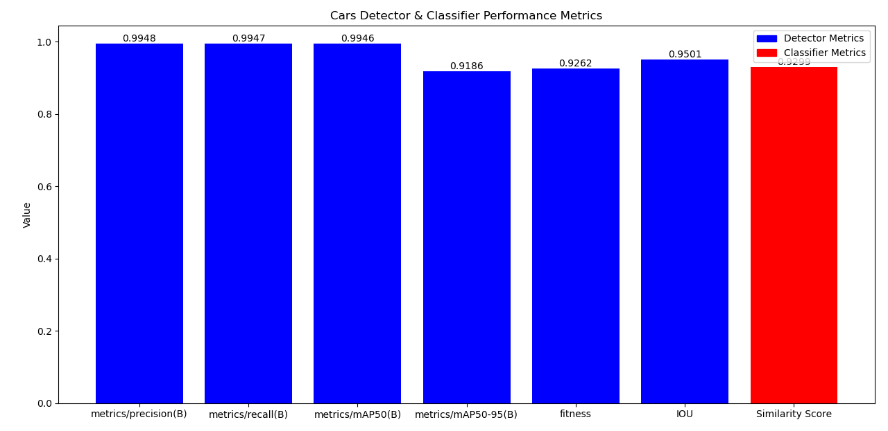

# Car Detection and Classification App

This Streamlit application detects cars in uploaded images and classifies them using YOLO11 for object detection and a Hugging Face Transformers model for car classification. The apps can be directly deploy since I already train the model and setup all the files for deployment. The initial process of data science life cycle begin with file `car-detection.py`. You may skip this instruction to the [Installation](#7-installation) and [Live Application](#10-live-application). In addition, this repository also have the file `faster-rcnn.py` for faster-RCNN modelling. However, the computational cost is too high to train 2gb data using my computer, hence I can't really compared the other deep learning model such as Faster-RCNN and SSD.

## 1. Data Loading and Exploration

1.  **Dataset Loading:**
    -   The Stanford Cars Dataset is loaded from Kaggle using `kagglehub`.
    -   Annotation data is loaded from `cars_annos.mat` using `scipy.io`.
    -   Class names are extracted from `cars_meta.mat`.

2.  **Data Preprocessing:**
    -   Annotation data is converted from a dictionary to a Pandas DataFrame.
    -   A label dictionary is created to map class IDs to class names.
    -   Functions are defined to load and plot images with bounding boxes.

3.  **Data Visualization:**
    -   Sample images are displayed with their class names and bounding boxes using `matplotlib`.
    -   The dataset is explored for inconsistencies in the annotation data, and a corrected annotation file is used.

## 2. Data Preparation for YOLO11

1.  **Annotation Conversion:**
    -   Functions are defined to create YOLO-compatible text files from the annotation DataFrame.
    -   Bounding box coordinates are normalized to the range \[0, 1].
    -   Text files are generated for both training and testing datasets.

2.  **Data Organization:**
    -   Image and label files are moved to appropriate directories (`car_data/image` and `car_data/label`).
    -   Text annotation files are moved to the same directory as their corresponding images.

3.  **YAML File Creation:**
    -   A YAML file (`cars_data.yaml`) is created to define the dataset paths and class names for YOLO.

## 3. Model Training and Evaluation - YOLO

1.  **Model Initialization:**
    -   A YOLO11 model is initialized using a pre-trained `yolo11n.pt` model.

2.  **Model Training:**
    -   The model is trained using the created `cars_data.yaml` file.
    -   Training parameters include epochs, image size, and time constraints.
    -   The trained model weights are saved.

3.  **Model Evaluation (Detection):**
    -   The trained model is evaluated using the validation dataset.
    -   Metrics such as precision, recall, and mAP are calculated.
    -   Intersection over Union (IoU) is calculated to assess bounding box accuracy.

4.  **Prediction:**
    -   The trained YOLO model is used to predict bounding boxes on the test dataset.

## 4. Model Evaluation - Car Classifier

1.  **Classifier Initialization:**
    -   A pre-trained car classification model is initialized using the Hugging Face `pipeline`.

2.  **Classification:**
    -   The classifier is used to predict car classes for the test dataset images.

3.  **Similarity Score Calculation:**
    -   Jaro-Winkler similarity is used to compare predicted class names with ground truth class names, as accuracy is not suitable for string comparison.

4.  **Combined Evaluation Metrics:**
    -   The detection metrics from YOLO and the similarity score from the classifier are combined into a single dictionary.

5.  **Metrics Visualization:**
    -   A bar plot is generated to visualize the combined evaluation metrics.
    -   The plot includes labels and values for each metric, with different colors for detector and classifier metrics.
  
## 5. Evaluation Results



## 6. Dependencies

-   `kagglehub`
-   `ultralytics`
-   `scipy.io`
-   `numpy`
-   `pandas`
-   `matplotlib`
-   `opencv-python`
-   `torch`
-   `transformers`
-   `PIL`
-   `jellyfish`

## 7. Installation

1.  **Clone the Repository (if applicable):**
    ```bash
    git clone https://github.com/dimashidayat99/car_detection_system.git
    cd car_detection_system
    ```

2.  **Create a Virtual Environment (Recommended):**
    ```bash
    python -m venv venv
    ```
    -   On Windows:
        ```bash
        venv\Scripts\activate
        ```
    -   On macOS and Linux:
        ```bash
        source venv/bin/activate
        ```

3.  **Install Required Packages:**
    ```bash
    pip install streamlit pillow ultralytics transformers opencv-python regex torch
    ```

4.  **Download the YOLO11 Model:**
    -   Ensure the YOLO11 model file (`best.pt`) is located in the `runs/detect/train5/weights/` directory. If you have a different path, make sure to change the path inside the streamlit app code.
    -   If you need to train your own model, follow the ultralytics documentation.

## 8. Deployment on Streamlit Cloud

1.  **Prepare your Repository:**
    -   Ensure your repository contains:
        -   `app.py` (your Streamlit application script). In my case, my app name `gui.py`
        -   `requirements.txt` (a list of your Python dependencies). This can be obtained through my `requirement.txt`
        -   `packages.txt` (a list of graphics library). This can be obtained through my `packages.txt`
        -   The trained YOLO11 model file (`runs/detect/train5/weights/best.pt` or your custom path).
        -   Any other necessary files.

2.  **Create `requirements.txt`:**
    -   Create a file named `requirements.txt` in the root of your repository.
    -   Add the following dependencies to the `requirements.txt` file:
        ```
        streamlit>=1.20.0
        torch>=2.0.0
        Pillow
        ultralytics
        transformers
        opencv-python
        regex
        ```
    -   If you have specific versions, add them like this: `streamlit==1.20.0`
  
3.  **Create `packages.txt`:**
    -   Create a file named `packages.txt` in the root of your repository.
    -   Add the following dependencies to the `packages.txt` file:
        ```
        libgl1
        libgl1-mesa-glx
        libegl1-mesa
        ```

4.  **Streamlit Cloud Setup:**
    -   Go to [Streamlit Cloud](https://streamlit.io/cloud).
    -   Sign up or log in with your GitHub account.
    -   Click "New app".
    -   Connect your GitHub repository to Streamlit Cloud.
    -   Specify the following:
        -   **Repository:** Your GitHub repository.
        -   **Branch:** The branch containing your app (usually `main` or `master`).
        -   **Main file path:** `yourfilename.py` for me it is `gui.py`
        -   Click "Deploy!".

5.  **Troubleshooting:**
    -   Check the Streamlit Cloud logs for any errors.
    -   Ensure all dependencies are correctly listed in `requirements.txt` and `packages.txt`.
    -   Verify that the model file is accessible by your application.
    -   Make sure the file paths are correct.

## 9. Usage

1.  Open the deployed Streamlit app in your browser.
2.  Click "Browse files" to upload one or more image files.
3.  The app will display the images with bounding boxes around detected cars and classify each car.
4.  The manufacturer and model of each classified car will be shown below the cropped car image.
5.  The app will also detect and classify multiple cars within a single image.

## 10. Live Application

The live application is ready to use at:
https://cardetectionsystem-assessment.streamlit.app/
